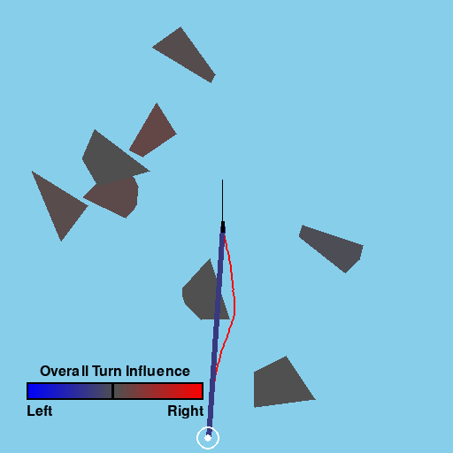

# BlueSky-Gym + XRL
A gymnasium style library for standardized Reinforcement Learning research in Air Traffic Management developed in Python, featuring native **Explainable RL (XRL)** capabilities.
Built on [BlueSky](https://github.com/TUDelft-CNS-ATM/bluesky) and The Farama Foundation's [Gymnasium](https://github.com/Farama-Foundation/Gymnasium)

<p align="center">
    <br/>
    <em>Dynamic feature attribution mapped directly to obstacle polygons and LiDAR rays using XRL.</em>
</p>

For a complete list of the currently available environments click [here](bluesky_gym/envs/README.md)

## Explainable RL (XAI) in BlueSky-Gym

BlueSky-Gym supports native post-hoc Explainable RL capabilities designed specifically to map deep RL policies to the operational context of air traffic control.

### Implementation Sketch
The explainability artifacts are implemented via the Gymnasium wrapper API (`bluesky_gym.wrappers.xrlMethods`). 
- **Wrapper Architecture:** Wrappers (e.g., `SaliencyStaticObstacleControl`) intercept the environment's `step()` and `render()` methods.
- **SHAP Integration:** At each step, a `shap.explainers.Permutation` explainer evaluates the RL model's policy. By masking observation features, it calculates the marginal contribution of individual features (like LiDAR rays or aircraft states) to the chosen action.
- **Dynamic Rendering:** The wrapper dynamically maps computed SHAP values onto the PyGame canvas. For instance, in `StaticObstacleEnv-v2`, individual LiDAR ray SHAP values are grouped by obstacle to dynamically color polygons (red/blue) based on their influence over the agent's steering.

### Usage

**Option A: Using the CLI (Quickstart)**
You can easily launch a visualization session using the provided CLI tool:
```bash
python src/XRL/xrl.py \
    --env StaticObstacleEnv-v2 \
    --method shap_safe_state \
    --model_suffix vecEnvLogs \
    --algo SAC
```

**Option B: Python API Integration**
To integrate XRL natively into your own loop, simply wrap your environment:
```python
import gymnasium as gym
import bluesky_gym
from bluesky_gym.wrappers.xrlMethods.state.saliency.static_obstacle_envV2_saliency import SaliencyStaticObstacleControl

bluesky_gym.register_envs()

# 1. Initialize the base environment
env = gym.make('StaticObstacleEnv-v2', render_mode='human', debug_lidar=True)

# 2. Wrap it with the XAI Saliency wrapper
env = SaliencyStaticObstacleControl(env)

obs, info = env.reset()
done = truncated = False
while not (done or truncated):
    # Pass pre-computed shap values to the step if needed, or let the wrapper compute them
    action = ... # Your agent code here
    obs, reward, done, truncated, info = env.step(action)
```

### XAI Contributors
The Explainable RL (XAI) module and visualization wrappers were contributed by Stefan Hamm and Alexander Beiser.

## Installation

`pip install bluesky-gym`

Note that the pip package is `bluesky-gym`, for usage however, import as `bluesky_gym`.

## For cuda enabled systems, it is recommended to install PyTorch with cuda support separately.

`pip install torch torchvision torchaudio --index-url https://download.pytorch.org/whl/cu118`

## Usage
Using the environments follows the standard API from Gymnasium, an example of which is given below:

```python
import gymnasium as gym
import bluesky_gym
bluesky_gym.register_envs()

env = gym.make('MergeEnv-v0', render_mode='human')

obs, info = env.reset()
done = truncated = False
while not (done or truncated):
    action = ... # Your agent code here
    obs, reward, done, truncated, info = env.step(action)
```

Additionally you can directly use algorithms from standardized libraries such as [Stable-Baselines3](https://stable-baselines3.readthedocs.io/en/master/) or [RLlib](https://docs.ray.io/en/latest/rllib/index.html) to train a model:

```python
import gymnasium as gym
import bluesky_gym
from stable_baselines3 import DDPG
bluesky_gym.register_envs()

env = gym.make('MergeEnv-v0', render_mode=None)
model = DDPG("MultiInputPolicy",env)
model.learn(total_timesteps=2e6)
model.save()
```

For more info, please refer to the [workshop slides](https://docs.google.com/presentation/d/1Jpwdrx__OMdgHWtQ1yCVQyxsdDFk2ieX/edit?usp=drive_link&ouid=109800667545002770848&rtpof=true&sd=true) that provide additional information on BlueSky-Gym and how to use it for your own needs.


## Contributing and Assistance
If you would like to contribute to BlueSky-Gym or need assistance in setting up or creating your own environments, do not hesitate to open an issue or reach out to one of us via the BlueSky-Gym [Discord](https://discord.gg/s7CdxcSX).
Additionally you can have a look at the [roadmap](https://github.com/TUDelft-CNS-ATM/bluesky-gym/issues/24) for inspiration on where you can contribute and to get an idea of the direction BlueSky-Gym is going.


## Citing

If you use BlueSky-Gym in your work, please cite it using:
```bibtex
@misc{bluesky-gym,
  author = {Groot, DJ and Leto, G and Vlaskin, A and Moec, A and Ellerbroek, J},
  title = {BlueSky-Gym: Reinforcement Learning Environments for Air Traffic Applications},
  year = {2024},
  journal = {SESAR Innovation Days 2024},
}
```

List of publications & preprints using `BlueSky-Gym` XAI:
*   Will be added in the future
